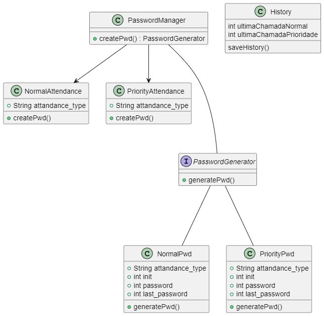

1 - Gerar a fila de senhas, a senha sera sequencial e armazenada no banco de dados.
modelo :
user = {
    'name' : 'Fulano',
    'atendimento' : 'Consulta',
    'dataEntrada' : datetime.datetime.utcnow()
    'senha' : get_senha()
}

2 - salvar os dados do usuario e a senha utilizada
3 - mostrar a senha chamadada e ultima senha
4 - Salvar dados no mongoDB

